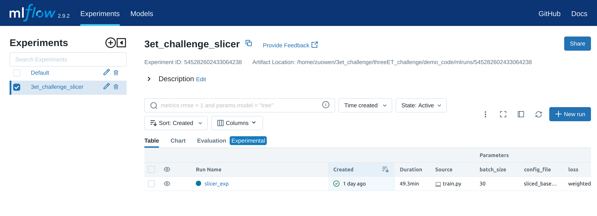

# [Event-based Eye Tracking Challenge 2025](https://lab-ics.github.io/3et-2025.github.io/) 

**[Qinyu Chen<sup>1</sup>](https://scholar.google.com/citations?user=enuSO2YAAAAJ&hl=en), [Min Liu<sup>2</sup>](https://scholar.google.com/citations?user=9YYkL8kAAAAJ&hl=en), [Junyuan Ding<sup>2</sup>](https://scholar.google.com/citations?user=9YYkL8kAAAAJ&hl=en), [Ziteng Wang<sup>2</sup>](https://www.linkedin.com/in/ziteng-wang-19b770234), [Tao Han<sup>5</sup>](https://www.linkedin.com/in/tao-han-05b2292b9), [Daniele Perrone<sup>3</sup>](https://scholar.google.com/citations?user=sQ9N7dsAAAAJ&hl=en), [Zongwei Wu<sup>4</sup>](https://scholar.google.fr/citations?user=3QSALjX498QC&hl=en), [Guohao Lan<sup>5</sup>](https://scholar.google.com/citations?user=1ebZN5gAAAAJ&hl=en), [Chang Gao<sup>5</sup>](https://scholar.google.com/citations?user=sQ9N7dsAAAAJ&hl=en)**

[1. Leiden University](https://scholar.google.com/citations?user=enuSO2YAAAAJ&hl=en)

[2. DVSense](https://scholar.google.com/citations?user=9YYkL8kAAAAJ&hl=en)

[3. Prophesee](https://scholar.google.com/citations?user=sQ9N7dsAAAAJ&hl=en)

[4. University of Wurzburg](https://www.informatik.uni-wuerzburg.de/computervision/)

[5. TU Delft](https://www.tudemi.com/)

## @ <a href="https://tub-rip.github.io/eventvision2025/" target="_blank">Event-based Vision Workshop @ CVPR 2025</a>


## Important Dates

- Challenge Start: February 15, 2025, 01:00 CET (GMT+1)
- Challenge End: March 15, 2025, 23:59 CET (GMT+1)  
- Top-ranking teams submission deadline (factsheet, code, paper): March 25, 2025, 23:55 CET (GMT+1)
- Challenge report deadline: April 5, 2025, 23:59 CET (GMT+1)
- Paper review deadline: April 5, 2025, 23:59 CET (GMT+1)

## Prize

Top-1-ranking team will get a Meta Quest 3 as the prize (Sponsored by DVsense).

## Citation and  acknowledgement

```
@inproceedings{wang2024event,
  title={Event-based eye tracking. AIS 2024 challenge survey},
  author={Wang, Zuowen and Gao, Chang and Wu, Zongwei and Conde, Marcos V and Timofte, Radu and Liu, Shih-Chii and Chen, Qinyu and Zha, Zheng-Jun and Zhai, Wei and Han, Han and others},
  booktitle={Proceedings of the IEEE/CVF Conference on Computer Vision and Pattern Recognition},
  pages={5810--5825},
  year={2024}
}

@inproceedings{chen20233et,
  title={3et: Efficient Event-based Eye Tracking Using a Change-based Convlstm Network},
  author={Chen, Qinyu and Wang, Zuowen and Liu, Shih-Chii and Gao, Chang},
  booktitle={2023 IEEE Biomedical Circuits and Systems Conference (BioCAS)},
  pages={1--5},
  year={2023},
  organization={IEEE}
}
```

<!-- 
🚀 🚀 🚀 **News**

-  ["Efficient Deep Models for Real-Time 4K Image Super-Resolution. NTIRE 2023 Benchmark and Report"](https://openaccess.thecvf.com/content/CVPR2023W/NTIRE/papers/Conde_Efficient_Deep_Models_for_Real-Time_4K_Image_Super-Resolution._NTIRE_2023_CVPRW_2023_paper.pdf)
- ["Towards Real-Time 4K Image Super-Resolution"](https://openaccess.thecvf.com/content/CVPR2023W/NTIRE/papers/Zamfir_Towards_Real-Time_4K_Image_Super-Resolution_CVPRW_2023_paper.pdf)
- [Project website](https://eduardzamfir.github.io/NTIRE23-RTSR/) 
- Dataset release soon (mid-June) -->
<!-- - Presentation June 18th NTIRE workshop. -->


## About the Challenge
Developing an event-based eye-tracking system presents significant opportunities in diverse fields, notably in consumer electronics and neuroscience. Human eyes exhibit rapid movements, occasionally surpassing speeds of 300°/s. This necessitates using [event cameras](https://www.youtube.com/watch?v=6xOmo7Ikwzk&t=80s&ab_channel=Sony-Global) capable of high-speed sampling and tracking. 

<figure align="center">
    
    <figcaption>Figure 1. Let's play some video game with event-based eye-tracking!</figcaption>
</figure>


In consumer electronics, particularly in augmented and virtual reality (AR/VR) applications, the primary benefits of event-based systems extend beyond their high speed. Their highly sparse input data streams can be exploited to reduce power consumption. This is a pivotal advantage in creating lighter, more efficient wearable headsets that offer prolonged usage and enhanced user comfort. 

This is instrumental in augmenting the immersive experience in AR/VR and expanding the capabilities of portable technology. In neuroscience and cognitive studies, such technology is crucial for deciphering the complexities of eye movement. It facilitates a deeper comprehension of visual attention processes and aids in diagnosing and understanding neurological disorders. 

This challenge aims to develop an **event-based eye-tracking system for precise tracking of rapid eye movements** to produce lighter and more comfortable devices for a better user experience. Simultaneously, it promises to provide novel insights into neuroscience and cognitive research, deepening our understanding of these domains.

## Quick Start
### Repository Structure
```
.
└── event_data/     # Dataset folder for storing downloaded data
    └── train/      # Training data
    └── test/       # Test data
└── backbone/       # Model architectures and configurations
└── cached_dataset/ # Cached preprocessed data (Automatically generated)
└── figures/        # Images and GIFs for documentation
└── metadata/       # Dataset metadata (Automatically generated)
└── mlruns/         # MLflow logging directory (Automatically generated)
└── utils/          # Helper functions and utilities
└── configs/        # Configuration files for training
    └── train_baseline.json # Training configuration for the baseline model
    └── test_config.json    # Testing configuration for the baseline model
└── train.py        # Training script
└── test.py         # Testing and submission generation script
└── dataloader.py   # Dataset and data processing utilities
└── model.py        # Model implementations
└── environment.yml # Conda environment specification
```
### Prepare Python Environment

You can set up the required Python environment using either conda with environment.yml or pip with requirements.txt.

- Using Conda (Recommended)
```bash
# Create and activate conda environment
conda env create -f environment.yml
conda activate eet
```

- Using Pip
```bash
# Create and activate virtual environment
python -m venv eet
source eet/bin/activate  # On Linux/Mac
# OR
.\eet\Scripts\activate  # On Windows

# Install requirements
pip install -r requirements.txt
```

### Dataset
Download The 3ET+ dataset from the competition page on [Kaggle](https://www.kaggle.com/competitions/event-based-eye-tracking-cvpr-2025/data). Put the dataset in the `./event_data` folder. (**The test dataset is bit different from last year, so please note that you should download the dataset from 2025 Kaggle site.**)

### Training
We provide a handy training script for you to start with. Simply install the dependencies in the environment.yml file with conda and run the following command:
```python
python train.py --config train_baseline.json
```

**Note about first epoch performance:** The first training epoch might be noticeably slower because the script caches preprocessed data (transformed voxel grid representations) to disk. This one-time caching process improves the speed of all subsequent epochs and future training runs by avoiding redundant preprocessing. You can control this caching behavior with the `--keep_cache` flag:
- Without `--keep_cache` (default): Cleans existing cache, ensuring all configuration changes take effect but requiring preprocessing again
- With `--keep_cache`: Keeps existing cached data, making training faster but potentially using stale preprocessing if you've modified dataset-related configurations

Play around with the hyperparameters and see if you can improve the performance!

### Monitoring Training Progress
We use [MLflow](https://mlflow.org/) to track experiments and visualize training progress. To monitor your runs:

```bash
mlflow ui --port 5000
```
Then open your browser and navigate to http://localhost:5000. You'll see a dashboard showing:
- Training and validation metrics
- Model parameters
- Saved artifacts (including checkpoints)
- Run history and comparisons



### Baseline Performance
We provide benchmark results using standard event voxel grid representation

| Method    | GPU            | Average Euclidean Distance  | PyTorch Version |
|-----------|----------------|-----------------------------|-----------|
| CNN_GRU   | RTX 4090 Mobile| 7.91384                     | 2.6.0|

This baseline implementation demonstrates the challenge's basic functionality. We encourage participants to experiment with:
- Different event representations
- Model architectures
- Training strategies
- Data augmentation techniques

### Preparing and Submitting Test Results

1. Generate test results using the provided test script:
```python
python test.py --config test_config.json --checkpoint [CHECKPOINT_PATH]
```
Note: If you trained your model with mlflow, the checkpoint should be saved in mlruns folder. You can find `CHECKPOINT_PATH` in the `MLflow UI` under `Artifacts` section.

2. Submit your results:
- Running `test.py` will generate a `submission.csv` file under the root directory. It contains three columns: 'row_id' 'x' and 'y'.
- Your Kaggle submission will be evaluated on Average Euclidean Distance
- For each prediction, the Euclidean distance is computed as: `sqrt((x_true - x_pred)^2 + (y_true - y_pred)^2)`
- The final score is the average of all these distances
- Note that x should be in range [0, 80] and y in range [0, 60]
- Note that ground truth is labeled at 100 Hz.

We will also assess the memory footprint using [Neurobench](https://github.com/NeuroBench/neurobench) of the Top-10 models on the private leaderboard, and the team with the lowest memory usage among them will be awarded a bonus workshop paper slot.

----
## **Dataset Description**
There are 13 subjects in total, each having 2-6 recording sessions. The subjects are required to perform 5 classes of activities: random, saccades, read text, smooth pursuit and blinks. Figure 2 visualizes one real recording sample by making the raw events into event frames. The total data volume is approximately 1 GB in the compressed .h5 form. 


<figure align="center">
    
    <figcaption>Figure 2. Eye movement filmed with event camera.</figcaption>
</figure>


#### **Dataloader**
We provide a very convienient dataloader for loading the dataset. The dataloader and transformations are based on the [Tonic](https://tonic.readthedocs.io/en/latest/index.html) event camera library. 

Preprocessing steps for event data is of particular importance and difficulty, since it is dependent on many aspects such as event representation, model input format requirement and the task itself. The dataloader we provide is a good starting point for the challenge. It slices the raw event recordings into strided sub-recordings and convert them into event voxel grids. It also enables local caching for the preprocessed data on the disk so that the program does not have to process the data everytime (But if it has different preprocessing parameter such as different stride, then it needs to be recached).

The event recordings are provided in the form of .h5 files of raw events. Each event is represented by a tuple of (t, x, y, p), where t represents the timestamp the event happened, (x, y) represents the spatial coordinate, and p represents the polarity of the event, +1 indicates the light intensity goes up and -1 indicates goes down. 

These raw events are loaded with
```python
train_data_orig = ThreeETplus_Eyetracking(save_to=args.data_dir, split="train", transform=transforms.Downsample(spatial_factor=factor), target_transform=label_transform)
```
'transform' and 'target_transform' essentially do the following:

* downsample spatially by the factor of 8 on width and height, to lower the training hardware requirement for the challenge (originally 640x480 to 80x60).

The challenger is **free to decide** whether to use the raw events in combination with models such as spiking neural networks or other methods, or to convert the raw events into event frames/ voxel grids and use them as input to the model, similiar to feeding an image to the model. 

In the following code sniplet we provide a common way of processing raw events and convert it into event voxel grids. 
```python
slicing_time_window = args.train_length*int(10000/temp_subsample_factor) #microseconds
train_stride_time = int(10000/temp_subsample_factor*args.train_stride) #microseconds

train_slicer=SliceByTimeEventsTargets(slicing_time_window, overlap=slicing_time_window-train_stride_time, \
                seq_length=args.train_length, seq_stride=args.train_stride, include_incomplete=False)
```
First we determine how to divide the raw recordings into sub-recordings. The 'slicing_time_window' is the length of each sub-recording, and the 'train_stride_time' is the stride between two consecutive sub-recordings. For example, if args.train_length=30 and temp_subsample_factor=0.2, then the slicing_time_window=30*(10000us/0.2)=1.5s. Meaning that each sub-recording is 1.5s long, and in this sequence, every event frame/ voxel grid will correspond to a recording time window of 10000us/0.2=50ms, and there will be 30 of them in this sub-sequence. Assume the args.train_stride is 5, then train_stride_time=5*(10000us/0.2)=250us, meaning that the next sub-recording will start 250us after the previous one. This is for expanding the total number of training samples.

**Important Note for Testing:** While you can experiment with different temporal subsample factors during training, the evaluation of test results must be performed at the original 100 Hz label frequency. Therefore, `temp_subsample_factor` must be set to 1.0 in your `test_config.json`. This ensures your predictions align with the ground truth labels for proper evaluation.

After the raw event sequence is sliced into raw event sub-sequences, we can convert each of them into different event representations. The transformations are defined in the following code sniplet. **SliceLongEventsToShort** is a transformation that separate the raw event sub-sequences further into (10000us)/temp_subsample_factor time windows. **EventSlicesToVoxelGrid** is a transformation that convert each time window into the actual event representation, in this case, voxel grids with args.n_time_bins number of time bins. 


```python

post_slicer_transform = transforms.Compose([
    SliceLongEventsToShort(time_window=int(10000/temp_subsample_factor), overlap=0, include_incomplete=True),
    EventSlicesToVoxelGrid(sensor_size=(int(640*factor), int(480*factor), 2), \
                            n_time_bins=args.n_time_bins, per_channel_normalize=args.voxel_grid_ch_normaization)
])

```

We then pass these transformations to the Tonic SlicedDataset class to post process the loaded raw events:
```python
train_data = SlicedDataset(train_data_orig, train_slicer, \
  transform=post_slicer_transform, metadata_path=f"./metadata/3et_train_tl_{args.train_length}_ts{args.train_stride}_ch{args.n_time_bins}")
```

The SlicedDataset has a convenient function to cache the indices of how the raw events are sliced, when argument metadata_path is provided not None. But be careful if you provided the same metadata_path for different slicing strategies, the SlicedDataset will ignore the slicing parameters and use the old indices, causing unexpected results.

We can further cache the transformed voxel grid representation on the disk to further speed up data preprocessing. This is done by the DiskCachedDataset class. It will slow done the first time loading the data but for future epoch and future training, it will be much faster.
```python
train_data = DiskCachedDataset(train_data, \
  cache_path=f'./cached_dataset/train_tl_{args.train_length}_ts{args.train_stride}_ch{args.n_time_bins}')

# at this point we can pass the dataset to the standard pytorch dataloader.
train_loader = DataLoader(train_data, batch_size=args.batch_size, shuffle=True, num_workers=int(os.cpu_count()-2), pin_memory=True)
```

You can easily find a lot of [data augmentation](https://tonic.readthedocs.io/en/latest/auto_examples/index.html) methods in the [Tonic](https://tonic.readthedocs.io/en/latest/index.html) library and include them in the dataloader to further improve the performance of your model.


#### Labeling
The ground truth is labeled at 100 Hz and consists of two parts for each label (x, y, close) with 

* labeling of the pupil center coordinates (x,y).

* a binary value 'close' indicating whether the eye blinks or not (0 for opening, 1 for closing). 

The user is free to decide at if they would like to use the close label or not.

#### Dataset splitting
We use 11 recordings for testing (test split) and the remaining recordings (train split) are for the user to train and validate their methods. The users are free to divide the training and validation sets from the training data. 

----

## Contact

- Qinyu Chen (q.chen@liacs.leidenuniv.nl)
- Chang Gao (chang.gao@tudelft.nl)

For more details, please contact [workshop](https://tub-rip.github.io/eventvision2025/) organizers.

## Program Committee Members (TBU)

- Qinyu Chen, Leiden University
- Chang Gao, TU Delft  
- Guohao Lan, TU Delft
- Tao Han, TU Delft
- Min Liu, DVSense
- Junyuan Ding, DVSense
- Ziteng Wang, DVSense
- Zongwei Wu, University of Wurzburg

## Previous Challenge

[Event-based Eye Tracking Challenge, AI for Streaming workshop](https://eetchallenge.github.io/EET.github.io/), in conjunction with CVPR 2024.

- 26 teams participated in the challenge
- 8 teams were invited to write challenge report together, and 4 teams' submissions were accepted as workshop papers
- We acknowledged to [Zuowen Wang](https://scholar.google.com/citations?user=pdZLukIAAAAJ&hl=en), Chang Gao, Zongwei Wu, Marcos V. Conde, Radu Timofte, Shih-Chii Liu, Qinyu Chen, and all the participants!
